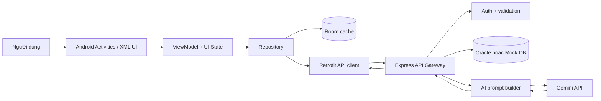

# Kiến trúc hệ thống FC Manager

## 1. Mục tiêu kiến trúc

- Tách giao diện, trạng thái và truy cập dữ liệu để dễ kiểm thử.
- Không đặt khóa Gemini hoặc thông tin kết nối database trong Android.
- Cho phép đọc danh sách đã đồng bộ khi backend tạm thời không khả dụng.
- Trả lỗi có cấu trúc để UI biểu diễn Loading, Empty, Error và Success nhất quán.

## 2. Sơ đồ thành phần

## 3. Phân lớp Android

### Presentation

- `Activity` và XML chịu trách nhiệm render, điều hướng và nhận thao tác.
- `PlayerViewModel` giữ trạng thái danh sách qua thay đổi cấu hình.
- UI không gọi database trực tiếp đối với luồng cầu thủ.

### Domain/model

- `Player`, `FundTransaction`, `Message` là model nghiệp vụ.
- Validation ràng buộc tên, số áo, vị trí, thống kê và chỉ số 0-99 trước khi gửi request.

### Data

- `PlayerRepository` phối hợp Room và Retrofit theo hướng cache-first.
- `PlayerDao` và `FundDao` cô lập câu lệnh SQLite.
- `ApiService` định nghĩa endpoint và DTO; `RetrofitClient` cấu hình base URL, timeout và authorization header.

## 4. Luồng đồng bộ cầu thủ

1. UI yêu cầu tải danh sách và chuyển sang Loading.
2. Repository đọc Room trên background thread.
3. Nếu cache có dữ liệu, UI nhận Success ngay.
4. Repository gọi backend; response hợp lệ thay thế cache trong một giao dịch logic.
5. Nếu mạng lỗi nhưng có cache, UI giữ dữ liệu và hiển thị cảnh báo không chặn.
6. Nếu mạng lỗi và cache rỗng, UI nhận Error thay vì loading vô hạn.

## 5. Luồng AI

1. Người dùng nhập câu hỏi; Android kiểm tra rỗng và khóa nút gửi trong lúc chờ.
2. Android gửi prompt và access token tới backend qua Retrofit.
3. Backend xác thực, kiểm tra độ dài prompt và lấy snapshot đội hình.
4. Prompt builder ghép system instruction, dữ liệu cầu thủ đã chuẩn hóa và câu hỏi.
5. Backend gọi Gemini bằng key trong biến môi trường.
6. Backend kiểm tra response, trả `reply`, thông tin model và cảnh báo giới hạn.
7. Android hiển thị trả lời hoặc Error state; không tự tạo câu trả lời AI giả.

Đây là **grounded generation bằng dữ liệu có cấu trúc**. Nó chỉ được gọi là RAG khi có bước retrieval chọn tài liệu/chunk theo truy vấn, embedding/index và cơ chế đánh giá retrieval.

## 6. Bảo mật

- Mật khẩu được dẫn xuất bằng thuật toán có salt ở backend; không lưu plain text.
- Access token có chữ ký và thời hạn; route nghiệp vụ kiểm tra token.
- `GEMINI_API_KEY`, secret ký token, API key tương thích và credential Oracle chỉ nằm trong `.env`.
- Repository chỉ theo dõi `.env.example`; `.env` thật bị Git ignore.
- Log không in secret hoặc mật khẩu.
- Cleartext HTTP chỉ dành cho development cục bộ; bản production phải dùng HTTPS và network security config chặt hơn.

## 7. Khả năng mở rộng

- Thay mock DB bằng Oracle mà không đổi contract Android.
- Tách use case/domain service khi số nghiệp vụ tăng.
- Đổi provider AI sau AI gateway mà không thay giao diện.
- Bổ sung lịch thi đấu, điểm danh và audit trail như module độc lập.

