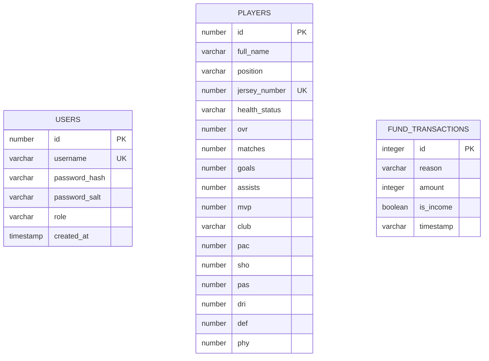

# Thiết kế cơ sở dữ liệu và REST API

## 1. ERD logic



`USERS` và `PLAYERS` thuộc backend (Oracle hoặc mock adapter). `FUND_TRANSACTIONS` được lưu cục bộ bằng Room trong MVP. Chưa có quan hệ khóa ngoại vì bản 1.0 quản lý một đội duy nhất; khi hỗ trợ nhiều đội cần thêm `TEAMS` và `team_id`.

## 2. Ràng buộc dữ liệu

- `username`: 3-50 ký tự, duy nhất.
- `password`: tối thiểu 8 ký tự khi nhận request; chỉ lưu bản dẫn xuất có salt.
- `full_name`: 1-100 ký tự.
- `position`: một trong `FW`, `MF`, `DF`, `GK`.
- `jersey_number`: 1-999, duy nhất trong đội.
- `pac`, `sho`, `pas`, `dri`, `def`, `phy`, `ovr`: 0-99.
- `matches`, `goals`, `assists`, `mvp`: số nguyên không âm.
- `amount`: số nguyên dương; chiều giao dịch lưu bằng `is_income`.

## 3. Quy ước response

Thành công:

```json
{
  "data": {},
  "meta": {}
}
```

Lỗi:

```json
{
  "error": {
    "code": "VALIDATION_ERROR",
    "message": "Dữ liệu không hợp lệ",
    "details": []
  }
}
```

Nếu implementation cũ cần giữ response phẳng để tương thích Android, tài liệu endpoint dưới đây mô tả đúng payload thực tế; không được thay contract mà không nâng version.

## 4. Authentication

### `POST /api/auth/register`

Request:

```json
{"username":"manager01","password":"Passw0rd!"}
```

Response `201`: thông tin user an toàn, không trả password/hash/salt. Lỗi: `400` validation, `409` username đã tồn tại.

### `POST /api/auth/login`

Request giống register. Response `200` gồm access token, thời gian hết hạn và user. Lỗi: `401` cho thông tin đăng nhập sai.

Các route `/api/players` và `/api/ai` yêu cầu `Authorization: Bearer <token>`. Nếu bật API key tương thích cho môi trường demo, giá trị phải lấy từ biến môi trường, không hard-code.

## 5. Players API

| Method | Endpoint | Chức năng | Thành công | Lỗi chính |
|---|---|---|---:|---|
| GET | `/api/players` | Danh sách theo số áo | 200 | 401, 500 |
| GET | `/api/players/:id` | Chi tiết một cầu thủ | 200 | 400, 401, 404 |
| POST | `/api/players` | Thêm cầu thủ | 201 | 400, 401, 409 |
| PUT | `/api/players/:id` | Cập nhật toàn bộ | 200 | 400, 401, 404, 409 |
| DELETE | `/api/players/:id` | Xóa | 204 | 400, 401, 404 |

Ví dụ player:

```json
{
  "id": 1,
  "fullName": "Nguyen Van A",
  "position": "FW",
  "jerseyNumber": 9,
  "healthStatus": "Fit",
  "ovr": 78,
  "matches": 12,
  "goals": 8,
  "assists": 3,
  "mvp": 2,
  "club": "FC Manager",
  "pac": 82,
  "sho": 80,
  "pas": 70,
  "dri": 79,
  "def": 45,
  "phy": 72
}
```

## 6. AI API

### `POST /api/ai/coach`

Request:

```json
{"prompt":"Hay xep doi hinh san 7 va giai thich lua chon."}
```

Response:

```json
{
  "reply": "...",
  "model": "cau-hinh-tu-bien-moi-truong",
  "groundedPlayerCount": 8,
  "warning": "Goi y tham khao; doi truong can xac minh truoc khi ap dung."
}
```

Lỗi: `400` prompt rỗng/quá dài; `401` chưa xác thực; `503` provider/key không khả dụng; `502` provider trả response không hợp lệ; `500` lỗi nội bộ đã được che thông tin nhạy cảm.

## 7. Migrations và dữ liệu mẫu

- Oracle DDL nằm tại `backend/schema.sql` và phải dùng cùng tên cột với route.
- Mock DB được tạo/migrate bằng code, không commit credential hoặc tài khoản thật.
- Dữ liệu demo cần tối thiểu 8 cầu thủ, bao phủ `GK`, `DF`, `MF`, `FW` để AI có thể xếp sân 7.

